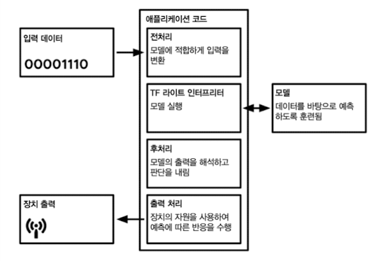
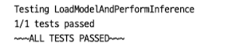
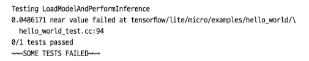

# 5 TinyML "Hello World" 애플리케이션 구축

5장에서는 sine model을 활용하여 작은 라이트 쇼를 만드는 embedded application을 구축할 것이다. x값을 모델에 공급, inference, 결과를 사용하여 LED를 점멸하고 장치에 LCD 디스플레이가 있는 경우, 애니메이션을 제어하는 연속 루프를 설정한다.

다음은 기본적인 TinyML application architecture를 나타낸 그림이다.



---

## 5.1 테스트 작성

application code 전에 test를 작성하는 편이 좋다, test는 특정 논리를 보여주는 짧은 code 조각으로, 이를 이용해 예상대로 작동하는지 확인하면서 검증해 나가면 편리하다.

---

### 5.1.1 종속성 불러오기

`#include`를 이용해서 header나 source file을 불러온다. 일반적으로 #include 지시문과 함께 사용하도록 설계된 C++ code는 source file이라는 .cc 파일과 header 파일이라는 .h 파일 두 개로 이루어진다.

> header file(.h)은 code가 program의 다른 부분에 연결될 수 있는 인터페이스를 정의한다. 여기에는 variable, class declaration 같은 것이 있지만 논리는 거의 없다.

> source file(.cc)은 계산과 작업을 수행하는 실제 논리를 구현한다. 예를 들어 micro_interpreter.h의 논리 부분은 micro_interpreter.cc에 포함되어 있다.

```cpp
#include "tensorflow/lite/micro/examples/hello_world/sine_model_data.h"
#include "tensorflow/lite/micro/kernels/all_ops_resolver.h"
#include "tensorflow/lite/micro/micro_error_reporter.h"
#include "tensorflow/lite/micdor/micro_interpreter.h"
#include "tensorflow/lite/micro/testing/micro_test.h"
#include "tensorflow/lite/schema/schema_generated.h"
#include "tensorflow/lite/version.h"
```

이 코드에서 `#include`를 사용하여 가져오는 항목은 다음과 같다.

- tensorflow/lite/micro/examples/hello_world/sine_model_data.h: xxd를 사용하여 훈련, 변환하고 C++ 코드로 바꾼 sine model

- tensorflow/lite/micro/kernels/all_ops_resolver.h: interpreter가 model에서 사용하는 Op를 load할 수 있게 하는 class.

  > 여기서 'Op'(Operation)은 일반적인 programming에서의 Op나 DevOps 등에서 자주 나오는 Ops와는 다른 의미다. TensorFlow Operation의 약자로, tensorflow에서 계산을 수행하는 Core Node(핵심 노드)를 의미한다.

- tensorflow/lite/micro/micro_error_reporter.h: debugging을 위해 오류와 출력을 기록하는 class

- tensorflow/lite/micro/micro_interpreter.h: model을 load하고 실행하는 code가 담겼다. microcontroller용 TFLite의 실행을 위해 필요하다.

- tensorflow/lite/micro/testing/micro_test.h: test 작성을 위한 간단한 framework. 이 파일을 실행하면 test가 이루어진다.

- tendorflow/lite/schema/schema_generated.h: sine_model_data.h의 model data를 이해하는 데 사용되는 TFlite FlatBuffers의 data structure를 정의하는 schema

  > [FlatBuffers](https://google.github.io/flatbuffers/)는 TFLite 팀이 사용하는 크로스 플랫폼 **serialization** library(직렬화 라이브러리)이다. 
  
  > runtime memory 내부 표현이 serialization된 형식과 정확히 동일해서 parsing이나 copy 작업 없이 model을 flash memory에 직접 내장하고 즉시 접근할 수 있다.(낭비되는 공간도 매우 적고 FlatBuffers를 위해 별도로 쓰이는 memory도 거의 없다.)

- tensorflow/lite/version.h: schema의 현재 version 번호. model이 호환 가능한 version으로 정의되어 있는지 확인할 수 있다.

---

### 5.1.2 test 설정

다음은 test framework에서 사용되는 부분이다.

```cpp
TF_LITE_MICRO_TESTS_BEGIN

TF_LITE_MICRO_TEST(LoadModelAndPerformInference) {
```

C++에서는 **macro** 기능을 이용해 code piece에 이름을 붙이고 다른 곳에서 재사용할 수 있다. 예제 code의 `TF_LITE_MICRO_TESTS_BEGIN`과 `TF_LITE_MICRO_TEST` 두 문장은 모두 macro의 이름이다. 이들은 `micro_test.h` 파일에 정의되어 있다. 이 macro는 나머지 code를 필요한 장치로 감싸서 MCU용 TFLite test framework에서 실행한다. 

> `TF_LITE_MICRO_TEST`라는 두 번째 macro는 parameter를 허용한다. 앞서 예시에서는 LoadModelAndPerformInference를 전달했는데, 이것이 test 이름이며 test가 실행될 때 결과와 함께 출력된다.

---

### 5.1.3 data 기록 준비

```cpp
// logging 설정(logging: 일련의 log를 생성하도록 하여 발생하는 event를 추적)
tflite::MicroErrorReporter micro_error_reporter;
tflite::ErrorReporter* error_reporter = &micro_error_reporter;
```

> 위처럼 tflite:: 접두어가 붙은 data type을 볼 수 있다. 이는 C++에서 사용하는 namespace로, C++에서는 function, variable, structure(구조체)가 속한 소속에 이름을 붙여줄 수 있다. namespace를 사용하면 다른 프로그래머가 짠 동일한 이름의 function도 namespace로 구별이 가능하다.

> 따라서 다른 library가 동일한 이름의 function을 제공한다고 해도, TFLite가 제공하는 class와 충돌하지 않는다.

- `MicroErrorReporter`: 'micro_error_reporter.h'에 정의되어 있으며, inference 과정 중에 debug 정보를 기록하는 매커니즘을 제공한다.

  - debug 정보를 출력하기 위해 이 class를 호출하면, MCU용 TFLite interpreter가 debug 정보를 이용해 error를 출력해 준다.

- `ErrorReporter* error_reporter`: 앞서 declaration한 micro_error_reporter의 class에 해당되는 `MicroErrorReporter`는 사실 `ErrorReporter`의 subclass이다. 재정의되지 않은 `ErrorReport` method에 계속 접근하기 위해서는, `MicroErrorReport` instance가 실제 ErrorReporter인 것처럼 처리해야 한다.

  - 즉, `ErrorReporter` pointer를 생성한 뒤 'micro_error_reporter' variable을 가리키면 된다. 할당 code에서 & 기호를 붙인 것은 address를 바탕으로 pointer를 할당함을 의미한다.

---

### 5.1.4 model mapping

```cpp
// model을 사용 가능한 data structure에 mapping한다.
// copy나 parsing을 하지 않는 가벼운 작업이다.

// model data array를 가져와서(sine_model_data.h 파일에 정의), GetModel()이라는 method에 전달한다.
// 이 method는 Model pointer를 model이라는 variable에 반환한다.
const tflite::Model* model = ::tflite::GetModel(g_sine_model_data);

// model의 버전 정보를 확인한다. 버전이 TFLITE_SCHEMA_VERSION와 불일치하면 디버그하기 어렵다.
// 일치하면 model이 호환되는 버전의 TFLiteConvertor로 변환되었다는 뜻이다. 
if (model -> version() != TFLITE_SCHEMA_VERSION) {
  // 버전이 일치하지 않으면 error_report를 사용해서 경고를 기록한다.
  error_reporter->Report(
    "Model provided is schema version %d not equal "
    "to supported version %d.\n", model -> version(), TFLITE_SCHEMA_VERSION);
    return 1; 
}
```

> Model type은 C++ 문법상 struct(구조체)에 해당된다. 이 struct는 'schema_generated_h'에 정의되어 있다. model data를 담고 있어 이에 대한 정보를 쿼리할 수 있다.

- 'model -> version()'에서 'version()'은 'model'에 속하는 method다. 

  > pointer 객체의 member에 접근하기 위해 arrow operator(->, 화살표 연산자)를 사용한다. pointer가 아닌 객체의 경우 member를 dot(.)를 사용해서 접근할 수 있다. 

- 버전 불일치 시 `error_reporter`의 Report() method를 호출한다.

  > `error_reporter`도 pointer이므로 ->를 사용해서 Report() method에 접근한다.

---

### 5.1.5 AllOpsResolver 생성하기

앞서 error를 기록할 수 있는 code를 준비하고, model을 (struct로) load해서 호환되는 버전인지 체크까지 완료했다. 

```cpp
tflite::ops::micro::AllOpsResolver resolver;
```

'all_ops_resolver.h'에 정의된 이 AllOpsResolver class는 MCU용 TFLite Interpreter가 사용 가능한 모든 연산, 즉 Op에 접근할 수 있게 한다.(Interpreter에 제공한다.)

---

### 5.1.6 tensor arena 정의하기

model이 실행되는 동안 필요한 작업 memory space도 할당해 줘야 한다. model의 input, output, 중간 tensor를 저장하기 위해 할당한 이 space를 **tensor arena**(텐서 아레나)라고 부른다.

아래 예제에서는 size가 2048 byte인 array를 할당한다.

```cpp
// 입력, 출력, 중간 array에 사용할 memory space를 생성한다.
// model 최솟값을 찾으려면 시행착오가 필요하다.
const int tensor_arena_size = 2 * 1024;
uint8_t tensor_arena[tensor_arena_size];
```

그렇다면 tensor arena는 얼마나 커야 할까? 이는 model architecture에 따라 input, output, 중간 tensor로 필요한 memory 양이 다르므로 알기 어렵다. MCU는 memory 제한을 고려해야 하기 때문에 가능한 작을수록 좋으며, 단순한 방법으로는 시행착오를 겪으며 최적의 크기를 찾아갈 수 있다. 

> n * 1024로 array size를 지정하고, n의 값을 바꾸면서 최적의 크기를 찾는 것이다.

> 혹은 필요한 memory 양을 계산해 주는 algorithm이나 program을 사용한다.

---

### 5.1.7 Interpreter 생성하기

tensor_arena까지 declaration했으므로, 이제 Interpreter를 설정할 준비가 됐다. 먼저 'interpreter'라는 이름의 `MicroInterpreter`를 declaration한다.

```cpp
tflite::MicroInterpreter interpreter(model, resolver, tensor_arena, 
                                    tensor_arena_size, error_reporter);

// tensor_arena의 memory allocate된 곳에 각 tensor를 allocate하게 된다.
interpreter.AllocateTensors();
```

`MicroInterpreter` 객체인 interpreter를 보면, constructor(생성자)의 parameter로 지금까지 생성한 대부분의 객체가 전달되었다. 그리고 `AllocateTensors()` method를 호출하면, model에서 정의했던 tensor들을 'tensor_arena' 내부에서 적절하게 각각 할당해 준다.

> inference 전에 꼭 `AllocateTensors()`를 반드시 호출해야 한다. 안 그러면 inference에 실패한다.

---

### 5.1.8 input tensor 검사

Interpreter까지 만들었으므로 이제 model 정보를 제공해야 한다.

```cpp
TfLiteTensor* input = interpreter.input(0);
```

input tensor의 pointer는 `MicroInterpreter` 객체의 `input()` method를 호출하면 얻을 수 있다. 그런데 model은 여러 input tensor를 가질 수 있으므로, 원하는 tensor에 해당되는 index를 전달해야 한다. 

> 지금 예제에서는 input tensor가 하나만 있으므로 index로 0을 넣었다.

TFLite에서 tensor는 'c_api_internal.h'에 정의된 `TfLiteTensor` struct로 표현된다. TFLite는 tensor와 상호작용하고 학습할 수 있는 API를 제공하는데, 아래 예시 code를 보며 확인해 보자.

> keras layer에서는 input을 2D tensor로 감써서 제공받아야 한다. 예를 들어 input이 0이라면 \[\[0\]\] 형태가 되어야 한다.

```cpp
// input이 예상하는 속성을 갖는지 확인
// NE: Not Equal, 즉 nullptr인지 확인한다.
TF_LITE_MICRO_EXPECT_NE(nullptr, input);

// dims 속성은 tensor 모양을 알려준다.
// 현재 input은 element 한 개를 포함하는 2D tensor이므로 dims->size는 2다. 이를 확인한다.
TF_LITE_MICRO_EXPECT_EQ(2, input->dims->size);

// dims struct를 추가로 검사한다. dims->data는 각 dimension마다 dimension size를 나타내는 하나의 element를 갖는다.
// 두 dimension에 단일 element를 갖는지 재차 확인한다. 
TF_LITE_MICRO_EXPECT_EQ(1, input->dims->data[0]);
TF_LITE_MICRO_EXPECT_EQ(1, input->dims->data[1]);

// tensor는 다양한 data type으로 정의될 수 있으므로 type을 확인해 줄 필요가 있다.
// input은 32bit floating point이다. 이를 확인한다.
TF_LITE_MICRO_EXPECT_EQ(kTfLiteFloat32, input->type);
```

만약 확인한 결과가 의도와 일치하지 않는다면 error를 기록하고 test가 실패된 것으로 결과가 도출된다. 이외 **assertion**(어서션, debugging 시 bug를 파악하기 위한 macro)는 다음과 같은 것들이 있다.

| assertion code | 설명 |
| --- | --- |
| TF_LITE_MICRO_EXPECT(x) | x가 true로 평가되는지 확인한다. |
| TF_LITE_MICRO_EXPECT_EQ(x, y) | x와 y가 같은지 확인한다. |
| TF_LITE_MICRO_EXPECT_NE(x, y) | x가 y와 다른지 확인한다. |
| TF_LITE_MICRO_EXPECT_NEAR(x, y, epsilon) | x, y의 차이가 epsilon보다 작거나 같은지 확인한다. |
| TF_LITE_MICRO_EXPECT_GT(x, y) | (숫자 값) x가 y보다 큰지 확인한다. |
| TF_LITE_MICRO_EXPECT_LT(x, y) | (숫자 값) x가 y보다 작은지 확인한다. |
| TF_LITE_MICRO_EXPECT_GE(x, y) | (숫자 값) x가 y보다 크거나 같은지 확인한다. |
| TF_LITE_MICRO_EXPECT_LE(x, y) | (숫자 값) x가 y보다 작거나 같은지 확인한다. |

---

### 5.1.9 input을 이용해 inference 실행

inference를 시행하려면 input tensor에 값을 더한 뒤, interpreter에게 model을 호출하도록 지시해야 한다.

이때 input tensor 내용을 설정하는 데 `TfLitePtrUnion`을 사용한다. 이름대로 C++의 특수한 data type에 해당되는 union이며, 다양한 type의 data 중 하나를 지정하는 데 매우 유용한 data type이다.

`TfLitePtrUnion` union은 'c_api_internal.h'에 declaration되어 있다. code는 다음과 같다.

```cpp
typedef union {
  int32_t* i32;
  int64_t* i64;
  float* f;
  TFLiteFloat16* f16;
  char* raw;
  const char* raw_const;
  uint8_t* uint7;
  bool* b;
  int16_t* i16;
  TfLiteComplex64* c64;
  int8_t* int8;
} TfLitePtrUnion;
```

pointer type의 각 member는 data를 저장해야 하는 memory의 위치를 가리킨다. 그리고 이전처럼 interpreter의 `AllocateTensors()` method를 호출하면, tensor의 data가 저장되도록 allocate된 memory block을 가리키는 적절한 pointer로 설정된다.

tensor가 `kTfLiteFloat32` type인 경우 아래 예시처럼 `data.f`를 사용한다. 그리고 이 pointer가 해당 memory block을 가리키기 때문에, 대괄호([])를 사용해서 data를 저장할 위치를 지정할 수 있다.

```cpp
// input 제공
input -> data.f[0] = 0.;

// input으로 model을 생성하고 성공 여부를 확인한다.
TfLiteStatus invoke_status = interpreter.Invoke();
if (invoke_status != kTfLiteOk) {
  error_reporter -> Report("Invoke failed\n");
}
TF_LITE_MICRO_EXPECT_EQ(kTfLiteOk, invoke_status);
```

input tensor 설정을 마쳤으므로 다음은 inference를 실행할 차례다. `Invoke()` method를 사용하면 interpreter가 해당 model을 실행해서 inference한다. output은 model의 output tensor에 저장된다.

```cpp
TfLiteStatus invoke_status = interpreter.Invoke();
```

또한 `Invoke()` method는 `TfLiteStatus` 객체를 반환하며 inference의 성공 여부를 알려준다.(`kTfLiteOk` 또는 `kTfLiteError` 중 하나다.) 이를 이용해서 error가 있으면 보고하는 code를 추가한다.

```cpp
if (invoke_status != kTfLiteOk) {
  error_reporter -> Report("Invoke failed\n");
}

// 또한 kTfLiteOk인 경우만 test를 통과하도록 assertion을 추가해 준다.
TF_LITE_MICRO_EXPECT_EQ(kTfLiteOk, invoke_status);
```

---

#### 5.1.9.1 input 제공: vector, matrix

앞선 예시 model에서는 scalar input만을 허용하므로, 'input -> data.f[0] = 0.;'처럼 하나의 값만 입력해야 했다. 하지만 input이 여러 값으로 구성된 vector type이라면, memory 상에서 이어지게 element를 추가할 필요가 있다.

가령 vector [1 2 3]은 다음과 같이 설정할 수 있다.

```cpp
input -> data.f[0] = 1.;
input -> data.f[1] = 2.;
input -> data.f[2] = 3.;
```

만약 [[1 2 3] [4 5 6]]처럼 여러 vector로 구성된 matrix라면, hardware에서는 1차원으로밖에 data를 저장할 수 없으므로 구조를 1차원으로 줄이는 **flattening**(평탄화) 과정을 거쳐야 한다.

`TfLiteTensor`에서는 matrix를 왼쪽에서 오른쪽, 위에서 아래 순서대로 값을 allocate하며 flattening한다. `TfLiteTensor` struct는 실제 dimension이 어떻게 구성되었는지 기록을 가지고 있기 때문에, flattening을 적용해도 memory address의 어느 부분이 다차원 형태 element인지 알 수 있다.

```cpp
input -> data.f[0] = 1.;
input -> data.f[1] = 2.;
input -> data.f[2] = 3.;
input -> data.f[3] = 4.;
input -> data.f[4] = 5.;
input -> data.f[5] = 6.;
```

---

### 5.1.10 output 확인하기

output은 input과 마찬가지로 `TfLiteTensor`를 통해 접근할 수 있다.(쉽게 pointer를 얻을 수 있다.)

```cpp
TfLiteTensor* output = interpreter.output(0);
```

output도 input과 마찬가지로 2D tensor 안에 포함된 floating point scalar 값이다. test를 위해 output tensor의 size, dimension, data type을 검증한다.

```cpp
TF_LITE_MICRO_EXPECT_EQ(1, input->dims->data[0]);
TF_LITE_MICRO_EXPECT_EQ(1, input->dims->data[1]);
TF_LITE_MICRO_EXPECT_EQ(kTfLiteFloat32, output->type);
```

이제 output 값을 검사하고 기준을 충족하는지 확인한다. 먼저 이를 float variable 'value'에 할당한다.

```cpp
float value = output -> data.f[0];
```

> 그런데 inference가 실행될 때마다 output tensor는 새 값으로 덮어 씌워진다. 즉, inference를 계속 실행하면서 output 값들을 보존하려면, 따로 copy해서 보관하는 과정을 추가해야 한다.

`TF_LITE_MICRO_EXPECT_NEAR`를 사용해서 값이 예상 값과 비슷한지 확인한다. 아래 예시에서는 output(value)와 0(sin(0))의 값의 차이가 0.05 이내인지 검증한다.

```cpp
TF_LITE_MICRO_EXPECT_NEAR(0., value, 0.05);
```

> 이렇게 검증하는 이유는 우선 model이 근사한 값을 도출했을 가능성이 높고, 또한 floating point 연산에서는 기본적으로 오차가 발생하기 때문이다.

> 또한 이러한 오차는 랩톱 CPU나 아두이노처럼 hardware에 따라서도 다르게 나올 수 있기 때문에 기대 오차를 어느 정도 유연하게 설정해야 하는 상황도 존재한다.

앞의 test를 통과한 뒤에도 추가로 model이 제대로 작동하는지 확인하기 위해 여러 번 inference를 더 진행해 준다. inference를 다시 실행하려면 input tensor에 새 값을 할당하고, interpreter의 `Invoke()` method를 다시 호출한다.

```cpp
// 몇 가지 input으로 inference를 더 진행하고 output을 확인한다.
input -> data.f[0] = 1.;
interpreter.Invoke();
// input을 보존할 필요가 없으므로 output을 같은 위치에 할당한다.
value = output -> data.f[0];
TF_LITE_MICRO_EXPECT_NEAR(0.841, value, 0.05);

input -> data.f[0] = 3.;
interpreter.Invoke();
value = output -> data.f[0];
TF_LITE_MICRO_EXPECT_NEAR(0.141, value, 0.05);

input -> data.f[0] = 5.;
interpreter.Invoke();
value = output -> data.f[0];
TF_LITE_MICRO_EXPECT_NEAR(-0.959, value, 0.05);
```

마지막으로 macro를 사용해서 test 끝을 나타내면 마무리다.

```cpp
}
TF_LITE_MICRO_TESTS_END
```

---

### 5.1.11 test 실행하기

이 code는 MCU에서 실행하도록 설계하기는 했지만, 개발 시스템에서도 test를 빌드하고 실행할 수도 있다. 개인 컴퓨터를 사용하는 편이 훨씬 output을 logging하거나 code를 검토하기 편리하기 때문에, 로컬에서 작업을 먼저 수행하고 MCU에 code를 배포하는 방법을 추천한다.(또한 기기는 code를 배포하는 데에도 시간이 걸린다.)

(여러 software가 그렇듯) embedded application을 구축할 때는 일반적인 개발 시스템에서 최대한 많은 테스트 로직을 작성해서 검증하는 것이 좋다.

---

#### 5.1.11.1 code 둘러보기

test를 로컬에서 실행하기 위해서 몇 가지 작업이 필요하다. 우선 (보통은 OS에 미리 설치되어 있는) Git과 Make가 설치되었는지 확인한다.

```bash
$ git

$ make --version
```

설치가 제대로 되어 있다면 그 다음은 git을 이용해 tensorflow source code를 설치해야 한다.

```bash
$ git clone https://github.com/tensorflow/tensorflow.git
```

터미널에서 git clone으로 생성된 tensorflow 디렉터리로 이동하면 test를 위한 준비는 마무리된다.

---

#### 5.1.11.2 Make를 사용하여 test 실행하기

Make는 software 빌드 작업을 자동화하는 도구로, 개발자가 정의한 `Makefile`을 바탕으로 code를 빌드하고 실행한다.

> MCU용 TFLite의 `Makefile`은 'micro/tools/make/Makefile'에 정의되어 있다.

이제 Make를 사용하여 test를 실행한다. 이때 다음 명령은 git clone으로 생성된 tensorflow 디렉터리의 루트에서 실행해야 한다.

```bash
$ make -f tensorflow/lite/micro/tools/make/Makefile test_hello_world_test
```

- TFLite에서는 빌드하려는 대상(hello_world_test)에 test_ 접두어를 붙여서 제공하고 있다.

> test file인 'hello_world_test.cc' 파일은 'tensorflow/lite/micro/examples/hello_world/hello_world_test.cc'에 위치해 있다.



결과를 보면 source file 맨 위에 정의한 대로 test 이름 'LoadModelAndPerformInference'를 볼 수 있다. 아직 MCU에 포팅하지 않았는데도 inference를 성공적으로 수행한다.

만약 code가 잘못되었다면 출력에서 실패한 파일, 행 번호를 포함해 여러 유용한 정보를 제공한다. 다음은 'input->data.f[0] = 0.;'을 'input->data.f[0] = 1.;'로 수정하면서 assertion을 실패했을 때의 test 출력이다.



---

