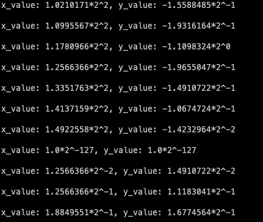

# 5 TinyML "Hello World" 애플리케이션 구축 이어서

## 5.2 프로젝트 파일 구조

실제 application의 source code를 일부 살펴볼 것이다. 현재 구축하는 program은 다음과 같은 과정을 거친다.

- x 값을 model에 공급한다.

- input을 바탕으로 inference를 시행한다.

- output을 사용해서 플랫폼에서 어떠한 가시적인 출력을 생성한다.

- 위 과정을 연속 루프로 구성한다.

application root는 'tensorflow/lite/micro/examples/hello_world'에 있으며 다음 file들이 포함되어 있다.

- BUILD: 기본 application binary. 이전에 수행한 test를 포함해 application의 source code를 사용해서 build할 수 있는 다양한 항목이 나열된 file이다.

- Makefile.inc: 이전에 실행한 test(hello_world_test)와 기본 application binary인 hello_world를 포함해서, application 내 build 대상의 정보가 포함된 `Makefile`이다. 일부 source file을 정의한다.

- README.md: application 빌드와 실행과 관련된 지시 사항을 포함하는 markdown(md) 텍스트 파일이다.

- constants.h, constants.cc: program 동작을 정의하는 데 중요한 다양한 상수를 포함하는 file들이다.

- create_sine_model.ipynb: ch04에서 살핀 jupyter notebook이다.

- hello_world_test.cc: model을 사용해 inference를 실행하는 test이다.

- main.cc: application이 장치에 배포되면, 장치에서 가장 먼저 실행되는 program 진입점이다.

- main_functions.h, main_functions.cc: `setup()`과 `loop()` function을 정의하는 file들이다.

  - `setup()`: program에 필요한 모든 initialization을 수행한다.

  - `loop()`: program의 핵심 logic을 포함하고, loop에서 state machine을 무한히 순환하도록 설계된 function이다.

- output_handler.h, output_handler.cc: inference가 실행될 때마다 output을 표시하는 데 사용할 수 있는 function을 정의하는 file들이다.

  - 이를 재정의해서 다른 장치에서 다른 작업을 수행하게 바꿀 수 있다.

- output_handler_test.cc: output_handler.h와 output_handler.cc code가 올바르게 작동하는지 증명하는 test다.

- sine_model_data.h, sine_model_data.cc: 이번 장에서 xxd를 사용해 C++ code로 바꾼 sine model이다.

이 file들 외에도 다음과 같은 하위 디렉터리를 포함한다. MCU 플랫폼마다 기능과 API가 다르기 때문에, 특정 장치용으로 빌드되었을 때를 대비한 main.cc, constants.cc, output_handler.cc 커스텀 버전이 포함되어 있다.

- arduino/

- disco_f76ng/

- sparkfun_edge/

---

## 5.3 source code 살펴보기

---

### 5.3.1 main_functions.cc

살펴보기 앞서 tensorflow/lite/schema/schema_generated.h에서 assertion으로 지정(static_assert)한 버전과 호환이 되어야 한다. 그렇지 않으면 include 과정에서 error가 발생한다. 다음은 'schema_generated.h'에서 해당 assertion을 나타내는 부분이다.

```cpp
static_assert(FLATBUFFERS_VERSION_MAJOR == 2 &&
              FLATBUFFERS_VERSION_MINOR == 0 &&
              FLATBUFFERS_VERSION_REVISION == 6,
             "Non-compatible flatbuffers version included");
```

> [FlatBuffers 가이드](https://google.github.io/flatbuffers/flatbuffers_guide_use_cpp.html), [C++ FlatBuffers github 다운로드](https://github.com/google/flatbuffers/releases) 문서를 참조하자.

> 예제 실습 중 C++ 버전 FlatBuffers(2.0.7)를 tensorflow/의 부모 디렉터리에 따로 설치하였다. 또한 assertion 부분을 2.0.7 버전으로 수정하였다.

include 부분은 앞서 파일 목록에서 설명했다.

```cpp
#include "tensorflow/lite/micro/examples/hello_world/main_functions.h"
#include "tensorflow/lite/micro/examples/hello_world/constants.h"
#include "tensorflow/lite/micro/examples/hello_world/output_handler.h"
#include "tensorflow/lite/micro/examples/hello_world/sine_model_data.h"
#include "tensorflow/lite/micro/kernels/all_ops_resolver.h"
#include "tensorflow/lite/micro/micro_error_reporter.h"
#include "tensorflow/lite/micro/micro_interpreter.h"
#include "tensorflow/lite/schema/schema_generated.h"
#include "tensorflow/lite/version.h"
```

이어지는 code는 main_functions.cc 내에서 사용할 global variable을 설정한다.

```cpp
namespace 
{
    tflite::ErrorReporter* error_reporter = nullptr;
    const tflite::Model* model = nullptr;
    tflite::MicroInterpreter* interpreter = nullptr;
    TfLiteTensor* input = nullptr;
    TfLiteTensor* output = nullptr;
    int inference_count = 0;

    // input, output, 중간 array에 사용할 memory space를 생성한다.
    constexpr int kTensorArenaSize = 2 * 1024;
    uint8_t tensor_arena[kTensorArenaSize];
}    // namespace
```

- 이중에서 유일하게 inference_count는 int type variable인데, program이 inference를 실행한 횟수를 기록한다.

위 variable들은 namespace로 묶여 있으므로, main_functions.cc상에서는 어느 곳에서나 접근할 수 있지만 프로젝트 내 다른 file에서는 접근할 수 없다. 이렇게 두 개의 서로 다른 file이 동일한 이름의 variable을 사용해서 생기는 문제를 방지할 수 있다.

다음 code는 `setup()` function을 declaration한다. `setup()` function은 inference를 시작하기 전에 수행해야 하는 모든 일회성 작업을 수행한다.

> 따라서 `setup()`은 program이 처음 시작될 때만 호출되고 그 이후에는 다시 호출되지 않는다.

code를 보면 앞서 진행한 test와 매우 비슷한 것을 확인할 수 있다.

```cpp
void setup() {
    // logging 설정
    static tflite::MicroErrorReporter micro_error_reporter;
    error_reporter = &micro_error_reporter;

    // model을 data structure에 mapping한다.
    model = tflite::GetModel(g_sine_model_data);
    if (model -> version() != TFLITE_SCHEMA_VERSION) {
        error_reporter -> Report(
            "Model provided is schema version %d not equal "
            "to supported version %d.",
            model -> version(), TFLITE_SCHEMA_VERSION
        );
        return;
    }
    // 필요한 모든 Op 구현을 가져온다.
    static tflite::ops::micro::AllOpsResolver resolver;

    // model을 실행할 interpreter를 빌드한다.
    static tflite::MicroInterpreter static_interpreter(
        model, resolver, tensor_arena, kTensorArenaSize, error_reporter
    );
    interpreter = &static_interpreter;

    // model tensor를 tensor_arena의 memory에 allocate한다.
    TfLiteStatus allocate_status = interpreter -> AllocateTensors();
    if (allocate_status != kTfLiteOk) {
        error_reporter -> Report("AllocateTensors() failed");
        return;
    }
    // ...
```

하지만 이 다음부터는 낯선 code가 등장한다. 먼저 input과 output tensor 모두의 pointer를 가져온다.

```cpp
// model input과 output의 pointer를 획득한다.
    input = interpreter -> input(0);
    output = interpreter -> output(0);
```

그런데 inference가 실행되기도 전에 어떻게 output의 pointer를 가져오는 것일까? 사실 이는 `TfLiteTensor`라는 struct를 가진 `data` member는 'output을 저장하기 위해 allocate된 memory space'를 가리킬 뿐이다. 다시 말해 output은 아직 작성되지 않았더라도 struct와 그 member인 `data`는 존재할 수 있다.

마지막으로 `setup()` function을 종료하기 위해 'inference_count' variable에 0을 할당한다.

```cpp
    inference_count = 0;
}
```

ML logic은 이것으로 마무리되었다. 다시 말해 inference를 실행하고 output을 얻기까지 필요한 도구는 모두 준비된 것이다. 이제 다음으로 필요한 것은 application logic이다.

앞서 model은 sine wave 전체 주기( $0$ ~ $2\pi$ )에서 x값의 모든 sine 값을 예측하도록 train됐다. 이 범위 내 숫자를 입력하여 inference output을 출력하고, 과정을 여러 번 실행한다면 model이 전체 범위에서 작동한다는 것을 증명할 수 있다. 

이러한 증명을 `loop()` function 안에서 무한히 반복해서 실행하는 code로 작성할 수 있다.

- 먼저 전달할 input(x) 값을 만들어 줘야 한다. 두 상수를 이용해서 만들어 낼 수 있다.

  - `kXrange`: input(x)의 최대값( $2\pi$ ) 나타낸다.

  - `kInferencesPerCycle`: $0$ ~ $2\pi$ 까지 단계적으로 수행하도록 정의한 inference의 총 횟수를 나타낸다.(현재의 'inference_count'와 비교해서 x를 정의할 것이다.)

  > C++에서는 상수 앞에 k를 붙이는 경우가 많다. 따라서 k를 보고 상수임을 쉽게 식별할 수 있다.

```cpp
void loop() {
    // input x를 생성한다.
    // 현재의 inference_count를 cycle당 inference 횟수와 비교해서 정한다.
    float position = static_cast<float>(inference_count) / 
                         static_cast<float>(kInferencesPerCycle);
    float x_val = position * kXrange;
    // ...
```

- 지금까지 inference를 수행한 횟수(inference_count)를 `kInferencesPerCycle`로 나누면 position, 즉 범위 내 현재 위치를 구할 수 있다.

- 그리고 position 값에 범위의 최댓값( $2\pi$ )인 `kXrange`를 곱해서 x_val을 구한다.

> `static_cast<float>()`은 해당 값을 floating point type으로 변환하기 위해 사용한 것이다. C++에서 두 int type에 나누기 계산을 하면 결과도 정수를 반환하기 때문에, 올바른 계산을 위해서는 이와 같이 casting이 필요하다.

이렇게 구한 x_val를 model로 전달한다. model의 input tensor에 입력해 주자.

> 참고로 최신 버전의 TFLite의 동일한 예제에서는 int8 quantization을 적용한 x_val, y_val값을 이용한다.

```cpp
// loop() 내부
    input -> data.f[0] = x_val;

    // inference를 실행하고 error가 있으면 보고
    TfLiteStatus invoke_status = interpreter -> Invoke();
    if (invoke_status != kTfLiteOk) {
        error_reporter -> Report("Invoke failed on x_val: %f\n",
                                 static_cast<double>(x_val));
        return;
    }

    // model의 output tensor가 예상한 y값을 읽는다.
    float y_val = output -> data.f[0];
```

code가 `loop()` 내부에서 실행되므로 시간이 지나면서 sine wave 수열이 생성될 것이다. 이러한 output을 이용해서 LED blink나 animation 제어를 해볼 수 있다.

이 output을 'output_handler.cc'에 정의된 `HandleOutput()` function을 호출해서 사용해 보자. 이 `HandleOutput()` function은 장비에 따라 커스텀해서 구현할 수 있다.

```cpp
    HandleOutput(error_reporter, x_val, y_val);
```

이때 `error_reporter` 인스턴스를 함께 parameter로 전달해서 log를 기록하는 데 사용한다. 이 code로 어떤 일이 발생하는지 알기 위해 'output_handler.cc' file을 한 번 살펴보자.

---

### 5.3.2 output_handler.cc의 output 처리

'output_handler.cc' file에서 `HandlerOutput()` function이 어떻게 정의되어 있는지 한 번 살펴보자. code는 매우 간단하다.

```cpp
void HandleOutput(tflite::ErrorReporter* error_reporter, float x_value, float y_value) {
    // 현재 x, y 값을 기록
    error_reporter -> Report("x_value: %f, y_value: %f\n", x_value, y_value);
}
```

code를 보면 `ErrorReporter` 인스턴스를 사용해서 x와 y 값을 기록하고 있는 것을 알 수 있다. 그런데 이는 최소한의 구현만 정의한 것이다. 현재 구현하고자 하는 application은 플랫폼의 특수 hardware를 이용해 output을 출력할 것이기 때문에 이를 커스텀하는 과정이 필요하다.

> 앞서 각 플랫폼에 대한 output_handler.cc의 커스텀 버전을 제공하고 있다는 사실을 언급했다.

---

### 5.3.3 main_functions.cc 정리

아직 `loop()`의 마무리를 짓지 않았다. 마지막으로 'inference_count' 카운터를 늘려주어야 한다. 그리고 'inference_count'가 `kInferencesPerCycle`에 정의한 'cycle당 최대 inference 수'에 도달하면 이를 0으로 재설정하도록 만든다.

```cpp
// loop() 내부

    // inference_counter를 증가시킨다.
    inference_count += 1;
    // cycle당 최대 inference 수에 도달하면 0으로 reset한다.
    if (inference_count >= kInferencesPerCycle) inference_count = 0;
```

이렇게 마무리한 `loop()`function은 매번 새로운 x값을 계산하고 inference를 실행한 뒤, `HandleOutput()`에서 output을 'output_handler.cc'에서 정의한 대로 활용한다.

그렇다면 이 `loop()` function을 반복해서 실행시키는 위치는 어디일까? 이는 'main.cc' file을 보면 알 수 있다.

---

### 5.3.4 main.cc 이해하기

모든 C++ program은 `main()`이라는 global function을 포함해야 한다. `main()`은 program이 시작되면서 실행되는 function으로 <U>'main.cc' file에 정의되어 있다.</U>

> 이러한 특성 덕분에 `main()` function가 program의 진입점 역할을 한다.

'main.cc' file은 매우 짧고 간단하다. 먼저 #include 문으로 'main_functions.h'를 포함시키고, 여기에 정의된 setup() 및 loop() function을 가져온다.

```cpp
#include "tensorflow/lite/micro/examples/hello_world/main_functions.h"

int main(int argc, char* argv[]) {
    setup();
    while (true) {
        loop();
    }
}
```

code를 보면 `setup()`은 호출되어 한 번만 수행되고, while infinite loop 안에 있는 `loop()`는 계속 호출되는 것을 알 수 있다.

그런데 대체로 지양되는 infinite loop를 사용해도 문제가 없을까?(이 loop는 단일 실행 thread를 차단하므로 program을 종료할 방법이 없다.) MCU용 software를 작성할 때 이러한 방식의 infinite loop는 실제로 매우 일반적인 방식이다.

> multitasking이 없고 오직 한 application만 실행되므로, infinite loop가 큰 문제가 되지 않는다. 결국 전원에 연결되어 있는 한 계속해서 inference를 진행하고 data를 출력하는 과정을 진행하게 된다.

---

### 5.3.5 application 실행하기

이제 application을 실행하기 위해 빌드하자. 먼저 Make 명령을 이용해서 binary를 생성한다.

```bash
make -f tensorflow/lite/micro/tools/make/Makefile hello_world
```

> 빌드 중에 발생하는 오류를 방지하고자 tensorflow/lite/micro/tools/make/Makefile 내부 몇 가지를 삭제했다.

```
# Load generated micro mutable op resolver test.
include ${MICRO_LITE_GEN_MUTABLE_OP_RESOLVER_TEST}
```

빌드가 완료되면 OS에 따라 다음 명령을 사용하여 binary를 실행할 수 있다. tensorflow/의 부모 디렉터리에서 다음 명령을 실행한다.

> 이와 다르게 구버전을 사용하는 책에서는 tensorflow/lite/micro/tools/make/gen/osx_x86_64/bin/hello_world 경로로 생성되었다.

> 경로의 osx_x86_64는 사용하는 OS마다 다르다.

```bash
# MAC OS
./gen/osx_arm64_default/bin/hello_world
```

binary를 실행하면 다음과 같은 출력이 쏟아진다. 이 출력들이 바로 'output_handler.cc'의 `HandleOutput()` function으로 작성된 log이다.



> 확인이 끝났다면 현재 로컬에서는 [Ctrl] + [C]로 program을 종료하자.

---